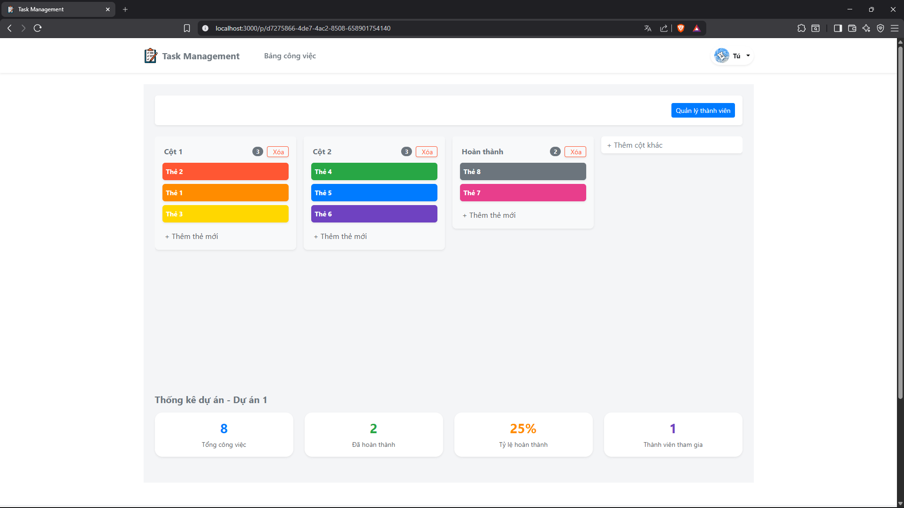
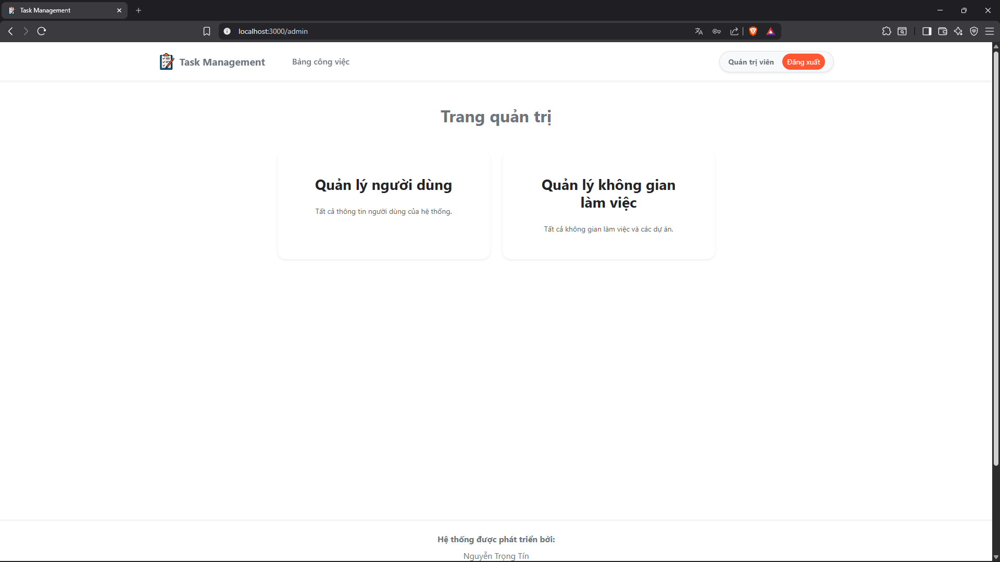
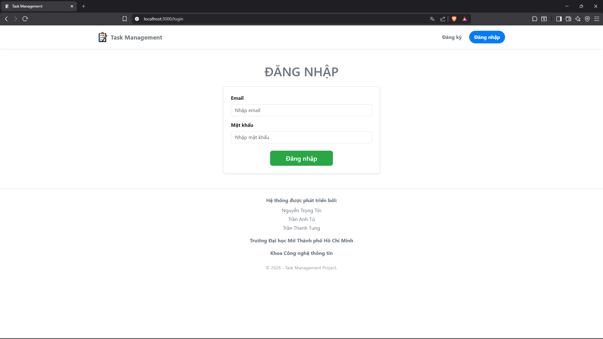
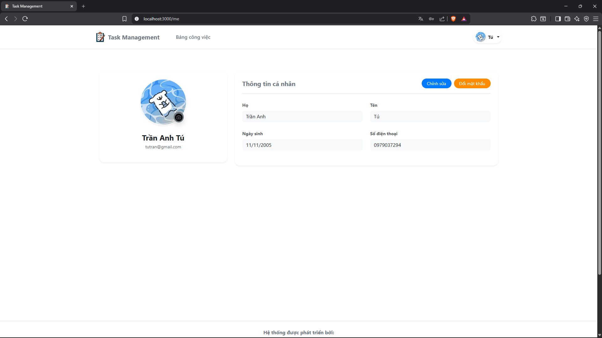
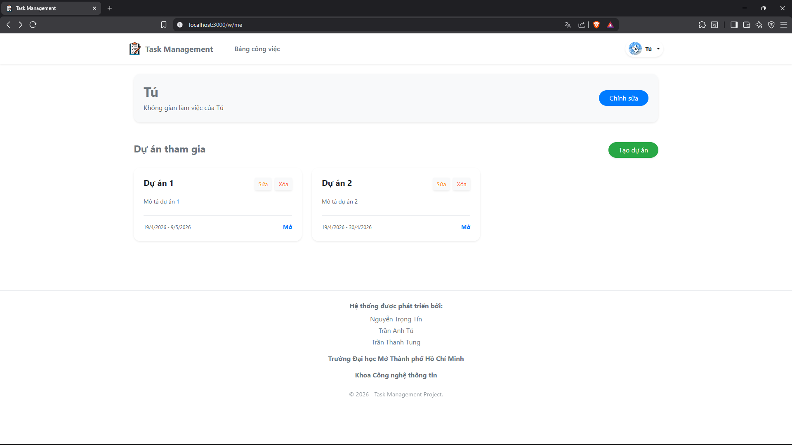

<div align="center">
    
 <h3>Full-stack Application with Microservices Architecture</h3>
</div>

---

## About

A Kanban-based task management system that allows teams to organize and track work progress visually.

The project is built with a focus on the following aspects:

- **Architectural compliance**: Microservices decomposed by domain, clear authentication and authorization, business
  logic that meets functional and regulatory requirements. System architecture is automatically validated through
  architecture tests.

- **Standard CI/CD pipeline**: A well-defined development and deployment workflow powered by GitHub Actions to automate
  all workflows.

- **Thorough documentation**: The system is documented following multiple standards including ADR, arc42, C4 Model,
  OpenAPI Specification, and UML diagrams for system modeling.

---

## Team Members

| Full Name        | Role In Team | Role In Project                             |
|------------------|--------------|---------------------------------------------|
| Nguyen Trong Tin | Leader       | Software Architect, Backend, DevOps, Tester |
| Tran Anh Tu      | Member       | Frontend Developer                          |
| Tran Thanh Tung  | Member       | Business Analyst                            |

---

## Architecture

The system applies a Microservices architecture on the server side, combined with two complementary architectural
styles: Event-Driven Architecture and Layered Architecture.

Other notable architectural patterns applied:

- API Gateway Pattern
- Database-per-Service
- Saga + Transactional Outbox Pattern
- Circuit Breaker

---

## Tech Stack

| Layer                | Technology                                               |
|----------------------|----------------------------------------------------------|
| **Frontend**         | JavaScript, React, Vite                                  |
| **Backend**          | Java, Spring Boot, Spring Security, Spring Cloud Gateway |
| **Database**         | PostgreSQL, Neo4j, MongoDB                               |
| **Broker**           | RabbitMQ                                                 |
| **Storage**          | Cloudinary                                               |
| **Email**            | Brevo SMTP                                               |
| **Authentication**   | JWT                                                      |
| **Containerization** | Docker, Docker Compose                                   |
| **CI/CD**            | GitHub Actions, GitHub Container Registry                |
| **Diagram as Code**  | Structurizr DSL                                          |
| **API Docs**         | OpenAPI Specification, Google Docs                       |
| **Testing**          | JUnit, JaCoCo, ArchUnit, k6                              |

---

## Quick Start

### Prerequisites

- Docker 24.0+
- Docker Compose 2.0+
- RAM 8GB+

### Docker Compose

```
git clone https://github.com/nguyentin05/task-management.git && cd task-management
cp .env.prod.example .env
docker compose -f docker-compose.prod.yml up -d
```

**Access**

| Service     | Port |
|-------------|------|
| Frontend    | 3000 |
| API Gateway | 8888 |

---

## Document Navigation

0. [Final Report (Google Docs)](https://docs.google.com/document/d/12IB5iFvMGrGveUsUzm1v6JzM1NbB_2d0WW5QALBUkTg)
1. [ADRs](docs/adrs/README.md)
2. [API](docs/api/README.md)</br>
   2.1. [Manual](docs/api/manual/README.md)</br>
   2.2. [OpenAPI](docs/api/openapi)
3. [Architecture](docs/architecture/README.md)</br>
   3.1. [Arc42](docs/architecture/arc42/README.md)</br>
   3.2. [C4](docs/architecture/c4/README.md)
4. [Diagrams](docs/diagrams/README.md)</br>
   4.1. [Class](docs/diagrams/class/class-diagram.md)</br>
   4.2. [Deployment](docs/diagrams/deployment/README.md)</br>
   4.3. [ERD](docs/diagrams/erd/README.md)</br>
   4.4. [Sequence](docs/diagrams/sequence/README.md)</br>
   4.5. [Usecase](docs/diagrams/usecase/usecase.png)

---

## Demo Screenshots

### Kanban Board



### Admin Dashboard



### Sign In



### Profile



### Workspace


