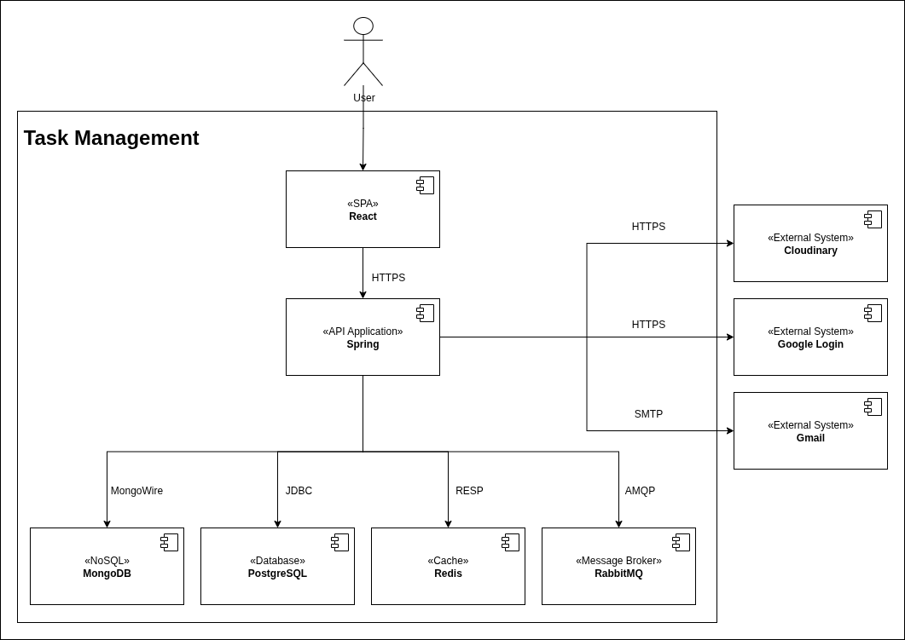

# Building Block View

The system contains 6 main parts: SPA, API Application, mongodb, postgresql, redis, rabbitmq 

## Whitebox Overall System

    
     
    <i>Building Block View Level 1</i>

## Strategy Mapping

| Quality goal       | Scenario                                                                         | Solution approach          | Link to Details |
|--------------------|----------------------------------------------------------------------------------|----------------------------|-----------------|
| *Bảo mật*          | *Hệ thống cần ngăn chặn truy cập trái phép vào API và bảo vệ dữ liệu người dùng* | *Stateless Authentication* | **              |
| *Hiệu năng*        | *Người dùng cần trải nghiệm mượt mà khi thao tác*                                | *Single Page Application*  | **              |
| *Khả năng bảo trì* | *Code cần dễ đọc, dễ sửa lỗi và mở rộng tính năng mới bởi nhiều thành viên*      | *Layered Architecture*     | **              |
| *Tính tương thích* | *Hệ thống cần độc lập nền tảng*                                                  | *RESTful API Standard*     | **              |
| *Triển khai*       | *Cần đảm bảo sự ổn định khi triển khai lên server thật*                          | *Containerization*         | **              |
