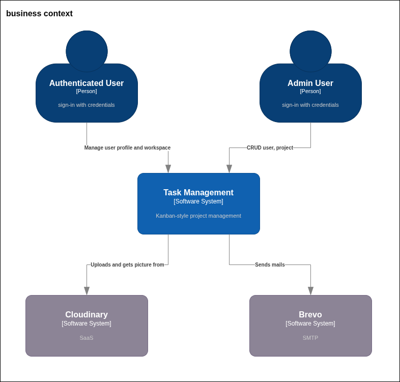
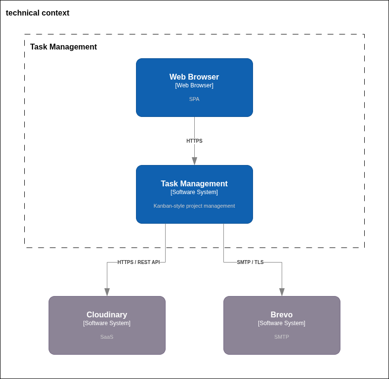

# 3. System Scope and Context

## 3.1. Business Context

    
     
    <i>Context Diagram</i>

| Neighbor             | Description                                                                                                                                   |
|----------------------|-----------------------------------------------------------------------------------------------------------------------------------------------|
| *Authenticated User* | *Người dùng chính của hệ thống. Sử dụng ứng dụng để khởi tạo dự án, quản lý công việc, theo dõi tiến độ và cộng tác với các thành viên khác.* |
| *Admin User*         | *Người quản trị hệ thống. Chịu trách nhiệm quản lý danh sách người dùng, workspace và xem các báo cáo thống kê mức độ hệ thống.*              |
| *Cloudinary*         | *Dịch vụ lưu trữ đám mây (SaaS). Được sử dụng để lưu trữ, quản lý và tối ưu hóa hình ảnh đại diện và các tệp ảnh đính kèm trong task.*        |
| *Brevo*              | *Hệ thống máy chủ Email. Đóng vai trò gửi các thông báo đến người dùng cuối.*                                                                 |

## 3.2. Technical Context

    
     
    <i>Context Diagram</i>

| Neighbor       | Protocol            | Định dạng dữ liệu | Đặc tả kỹ thuật                                                                                                                                                                                                                                     |
|----------------|---------------------|-------------------|-----------------------------------------------------------------------------------------------------------------------------------------------------------------------------------------------------------------------------------------------------|
| **Web Client** | HTTPS / RESTful API | JSON              | Trình duyệt của người dùng giao tiếp với hệ thống thông qua cổng duy nhất là API Gateway.                                                                                                                                                           |
| **Cloudinary** | HTTPS / API         | Multipart / URL   | Backend không lưu file. Khi upload, Profile Service dùng Cloudinary SDK đẩy luồng dữ liệu (Multipart) qua HTTPS. Khi hiển thị, Client tải ảnh trực tiếp qua mạng lưới CDN của Cloudinary bằng các HTTPS URL được lưu trong Database (theo ADR-017). |
| **Brevo**      | HTTPS / REST API    | JSON              | Notification Service đóng vai trò là client, gọi HTTP POST request đến API của Brevo để kích hoạt luồng gửi thư. Giao tiếp được xác thực bằng `API_KEY` bảo mật lưu trong cấu hình môi trường (theo ADR-020).                                       |
