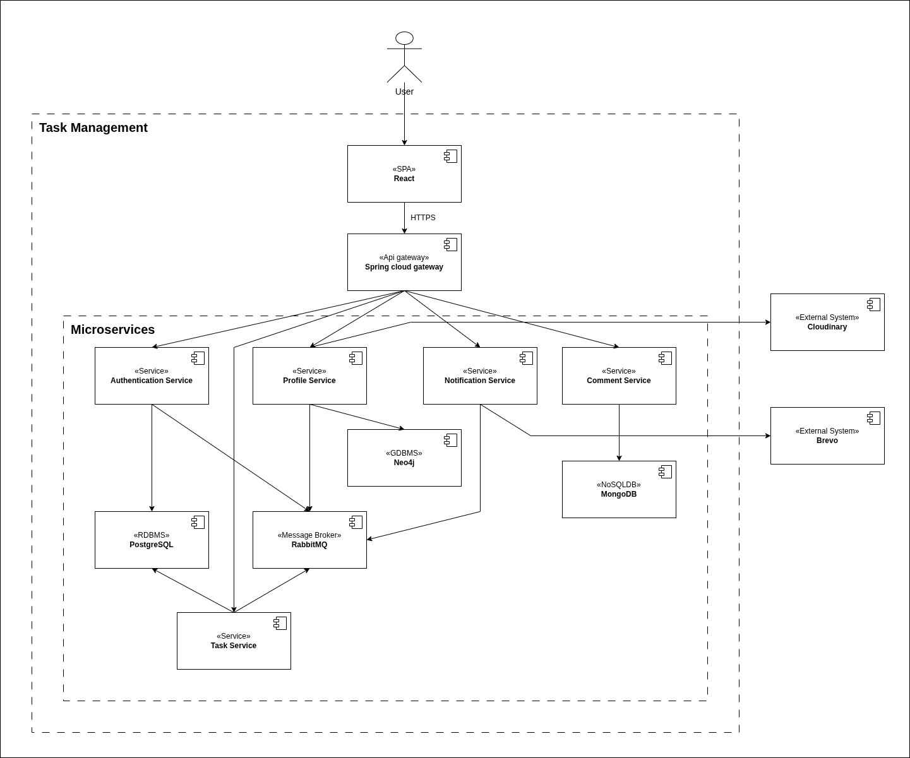
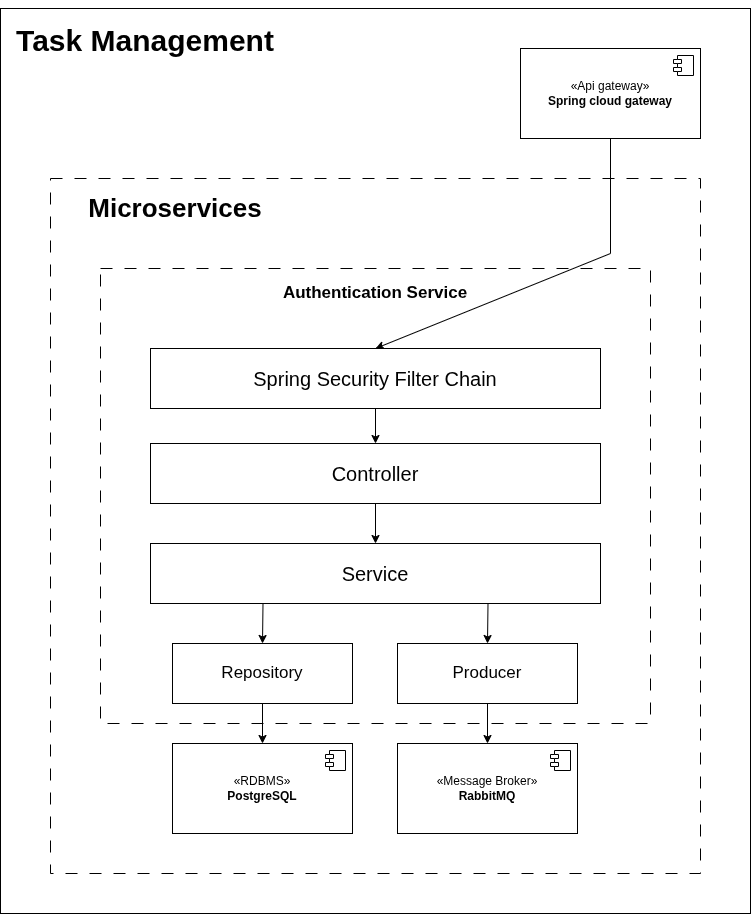
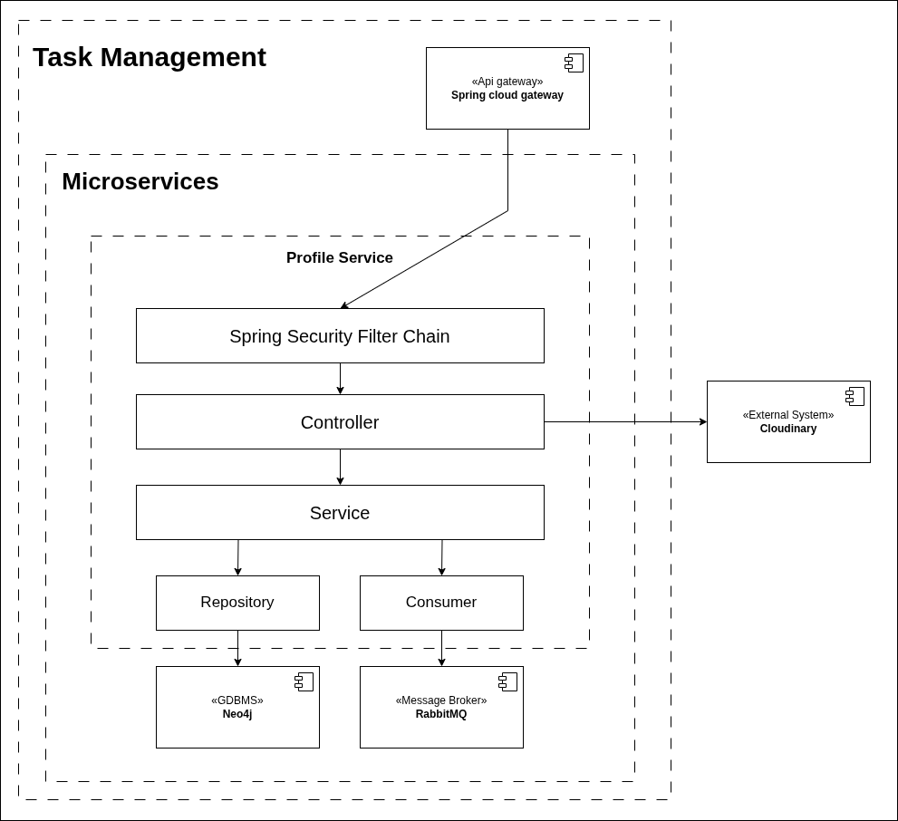
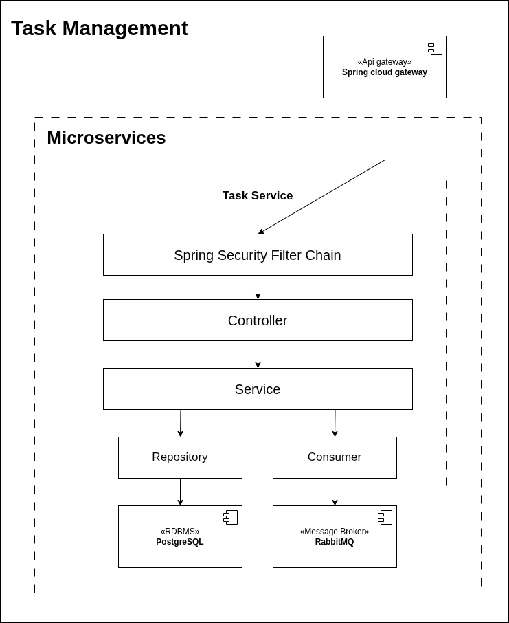
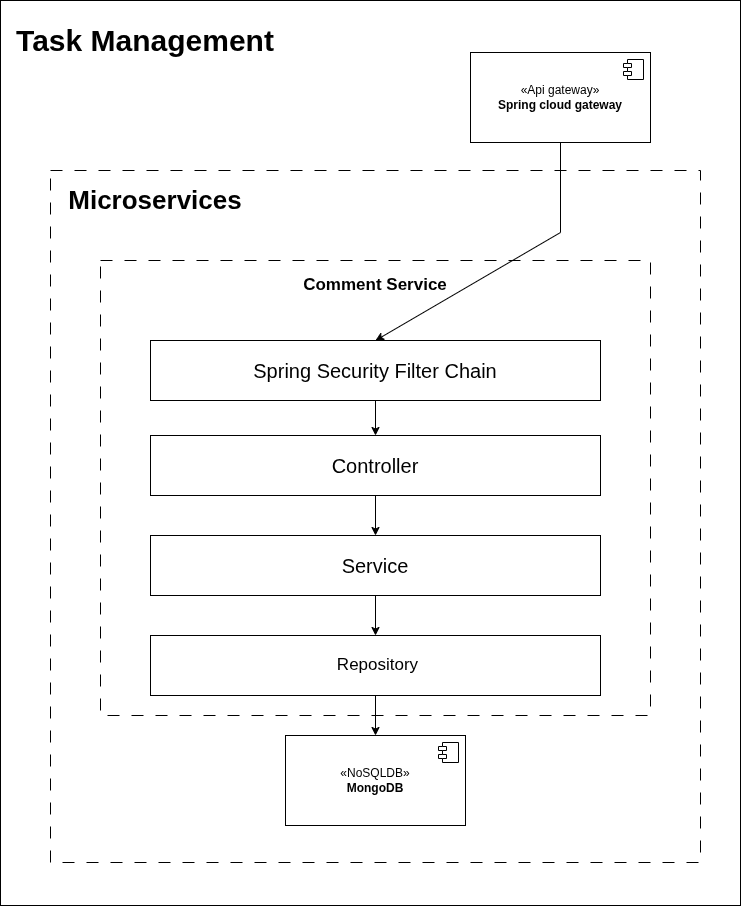
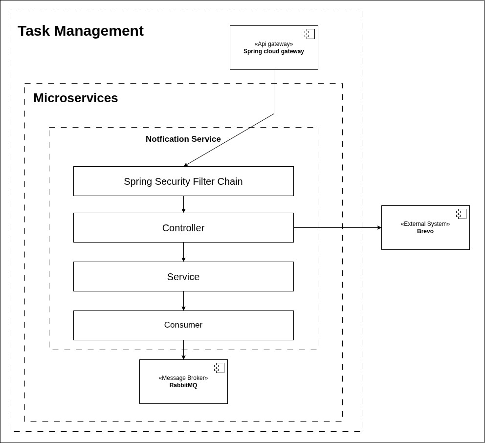

# 5. Building Block View

## 5.1. Whitebox Overall System

    
     
    <i>Building Block View Level 1</i>

| Building Block         | Description                            |
|------------------------|----------------------------------------|
| React SPA              | Giao diện người dùng                   |
| Spring Cloud Gateway   | Routing, JWT validation, rate limiting |
| Authentication Service | Đăng ký, đăng nhập, RBAC               |
| Profile Service        | Hồ sơ người dùng, avatar               |
| Task Service           | Workspace, Project, Task, Column       |
| Comment Service        | Bình luận trong Task                   |
| Notification Service   | Gửi email qua Brevo                    |
| RabbitMQ               | Message broker                         |
| PostgreSQL             | Cơ sở dữ liệu quan hệ                  |
| Neo4j                  | Cơ sở dữ liệu đồ thị                   |
| MongoDB                | Cơ sở dữ liệu không quan hệ            |

### 5.1.1. Authentication Service (Blackbox)

**Intent**

Authentication Service chịu trách nhiệm toàn bộ vòng đời xác thực: đăng ký tài khoản, đăng nhập, cấp phát JWT token, thu
hồi token khi logout, và quản lý Role/Permission theo mô hình RBAC.

**Interfaces**

| Interface                                 | Role  | Scope    | Mô tả                                           |
|-------------------------------------------|-------|----------|-------------------------------------------------|
| `POST /auth/token`                        | None  | External | Xác thực user và cấp token                      |
| `POST /auth/refresh`                      | None  | External | Cấp token mới từ nếu token còn thời hạn refresh |
| `POST /auth/log-out`                      | None  | External | Thu hồi token, thêm vào blacklist               |
| `POST /internal/auth/introspect`          | None  | Internal | Kiểm tra token                                  |
| `POST /auth/users/register`               | None  | External | Đăng ký tài khoản user                          |
| `GET /auth/users/me`                      | User  | External | Xem thông tin user đang đăng nhập               |
| `PUT /auth/users/me/change-password`      | User  | External | Đổi mật khẩu cá nhân                            |
| `POST /auth/users`                        | Admin | External | Tạo tài khoản user                              |
| `GET /auth/users`                         | Admin | External | Xem danh sách tất cả user                       |
| `GET /auth/users/{userId}`                | Admin | External | Xem chi tiết một user                           |
| `PUT /auth/users/{userId}/reset-password` | Admin | External | Đặt lại mật khẩu user                           |
| `PUT /auth/users/{userId}/roles`          | Admin | External | Thay đổi role hệ thống cho user                 |
| `DELETE /auth/users/{userId}`             | Admin | External | Xóa tài khoản user                              |
| `POST /auth/roles`                        | Admin | External | Tạo role                                        |
| `GET /auth/roles`                         | Admin | External | Xem danh sách tất cả role                       |
| `DELETE /auth/roles/{role}`               | Admin | External | Xóa role                                        |
| `POST /auth/permissions`                  | Admin | External | Tạo permission                                  |
| `GET /auth/permissions`                   | Admin | External | Xem danh sách tất cả permission                 |
| `DELETE /auth/permissions/{permission}`   | Admin | External | Xóa permission                                  |

**Database**

PostgreSQL
schema: auth_schema
tables: `users`, `roles`, `permissions`, `invalidated_tokens`, `users_roles`, `roles_permissions`

**Events Published**

| Event              | Hành động   |
|--------------------|-------------|
| `UserCreatedEvent` | Đã tạo user |

**Events Subscribed**

**Files**

`task-management/backend/authentication-service/`

---

### 5.1.2. Profile Service (Blackbox)

**Intent**

Profile Service chịu trách nhiệm quản lý hồ sơ cá nhân của người dùng: xem, cập nhật thông tin và ảnh đại diện.

**Interfaces**

| Interface                          | Role  | Scope    | Mô tả                                 |
|------------------------------------|-------|----------|---------------------------------------|
| `POST /internal/profiles`          | None  | Internal | Tạo profile                           |
| `GET /profiles/me`                 | User  | External | Xem profile cá nhân                   |
| `PATCH /profiles/me`               | User  | External | Cập nhật profile cá nhân              |
| `PUT /profiles/me/avatar`          | User  | External | Cập nhật ảnh đại diện profile cá nhân |
| `GET /profiles`                    | Admin | External | Xem danh sách tất cả profile          |
| `GET /profiles/{profileId}`        | Admin | External | Xem chi tiết một profile              |
| `PATCH /profiles/{profileId}`      | Admin | External | Cập nhật profile                      |
| `PUT /profiles/{profileId}/avatar` | Admin | External | Cập nhật ảnh đại diện profile         |

**Database**

Neo4j — node `UserProfile`

**Events Published**

**Events Subscribed**

| Event              | Publisher              | Hành động                             |
|--------------------|------------------------|---------------------------------------|
| `UserCreatedEvent` | Authentication Service | Tạo profile ứng với user vừa được tạo |

**External Systems**

Cloudinary — upload và lưu trữ ảnh đại diện

**Files**

`task-management/backend/profile-service/`

---

### 5.1.3. Task Service (Blackbox)

**Intent**

Task Service là core domain của hệ thống, chịu trách nhiệm toàn bộ nghiệp vụ quản lý công việc theo mô hình Kanban:
Workspace, Project, Column, Task. Đây là service của luồng nghiệp vụ chính.

**Interfaces**

| Interface                                         | Role                 | Scope    | Mô tả                                      |
|---------------------------------------------------|----------------------|----------|--------------------------------------------|
| `POST /internal/workspaces`                       | None                 | Internal | Tạo workspace                              |
| `GET /workspaces/me`                              | User                 | External | Xem workspace cá nhân                      |
| `PATCH /workspaces/me`                            | User                 | External | Cập nhật workspace cá nhân                 |
| `GET /workspaces`                                 | Admin                | External | Xem danh sách tất cả workspace             |
| `GET /workspaces/{workspaceId}`                   | Admin                | External | Xem chi tiết một workspace                 |
| `PATCH /workspaces/{workspaceId}`                 | Admin                | External | Cập nhật workspace                         |
| `POST /projects`                                  | User/Admin           | External | Tạo project                                |
| `GET /workspaces/me/projects`                     | User                 | External | Xem project trong workspace cá nhân        |
| `GET /workspaces/{workspaceId}/projects`          | Admin                | External | Xem project của một workspace              |
| `GET /projects`                                   | Admin                | External | Xem danh sách tất cả project               |
| `GET /projects/{projectId}`                       | User/Admin           | External | Xem chi tiết một project                   |
| `PATCH /projects/{projectId}`                     | User - Manager/Admin | External | Cập nhật project                           |
| `GET /projects/{projectId}/statistics`            | User - Manager/Admin | External | Thống kê số liệu project                   |
| `DELETE /projects/{projectId}`                    | User - Manager/Admin | External | Xóa project                                |
| `POST /projects/{projectId}/members`              | User - Manager/Admin | External | Thêm thành viên vào project                |
| `GET /projects/{projectId}/members`               | User/Admin           | External | Xem danh sách thành viên của project       |
| `PUT /projects/{projectId}/members/{userId}`      | User - Manager/Admin | External | Thay đổi role của thành viên trong project |
| `DELETE /projects/{projectId}/members/{userId}`   | User - Manager/Admin | External | Xóa thành viên khỏi project                |
| `POST /projects/{projectId}/columns`              | User - Manager/Admin | External | Tạo column trong project                   |
| `GET /projects/{projectId}/columns`               | User/Admin           | External | Xem tất cả column trong project            |
| `PATCH /projects/{projectId}/columns/{columnId}`  | User - Manager/Admin | External | Cập nhật column trong project              |
| `DELETE /projects/{projectId}/columns/{columnId}` | User - Manager/Admin | External | Xóa column                                 |
| `POST /columns/{columnId}/tasks`                  | User/Admin           | External | Tạo task trong column                      |
| `PATCH /tasks/{taskId}`                           | User/Admin           | External | Cập nhật task                              |
| `PUT /tasks/{taskId}/move`                        | User/Admin           | External | Di chuyển task sang column khác            |
| `DELETE /tasks/{taskId}`                          | User/Admin           | External | Xóa task                                   |

**Database**

PostgreSQL
schema: task_schema
tables: `workspaces`, `projects`, `columns`, `tasks`, `workspace_project`, `project_member`, `task_assignee`

**Events Published**

**Events Subscribed**

| Event              | Publisher              | Hành động                               |
|--------------------|------------------------|-----------------------------------------|
| `UserCreatedEvent` | Authentication Service | Tạo workspace ứng với user vừa được tạo |

**Files**

`task-management/backend/task-service/`

---

### 5.1.4. Comment Service (Blackbox)

**Intent**

Comment Service quản lý toàn bộ bình luận trong Task, hỗ trợ trao đổi trực tiếp giữa các thành viên dự án.

**Interfaces**

| Interface                       | Role       | Scope    | Mô tả                          |
|---------------------------------|------------|----------|--------------------------------|
| `POST /tasks/{taskId}/comments` | User/Admin | External | Tạo comment trong task         |
| `GET /tasks/{taskId}/comments`  | User/Admin | External | Xem danh sách comment của task |
| `PUT /comments/{commentId}`     | User/Admin | External | Cập nhật comment               |
| `DELETE /comments/{commentId}`  | User/Admin | External | Xóa comment                    |

**Database**

MongoDB — collection `comments`

**Events Published**

**Events Subscribed**

**Files**

`task-management/backend/comment-service/`

---

### 5.1.5. Notification Service (Blackbox)

**Intent**

Notification Service hoạt động hoàn toàn bất đồng bộ. Service lắng nghe event từ RabbitMQ và gửi email thông báo đến
người dùng qua Brevo.

**Interfaces**

| Interface                                | Role | Scope    | Mô tả     |
|------------------------------------------|------|----------|-----------|
| `POST /internal/notification/email/send` | None | Internal | Gửi email |

**Events Published**

**Events Subscribed**

| Event              | Publisher              | Hành động                         |
|--------------------|------------------------|-----------------------------------|
| `UserCreatedEvent` | Authentication Service | Gửi email chào mừng tài khoản mới |

**External Systems**

Brevo REST API — gửi email transactional qua HTTPS

**Files**

`task-management/backend/notification-service/`

---

### 5.1.6. Spring Cloud Gateway (Blackbox)

**Intent**

Spring Cloud Gateway là điểm vào duy nhất của toàn bộ hệ thống từ phía Client. Gateway chịu trách nhiệm validate token
trên mọi request trước khi chuyển đến service tương ứng.

**Interfaces**

| Interface                | Role               | Scope    | Mô tả                               |
|--------------------------|--------------------|----------|-------------------------------------|
| `/api/{version}/**`      | Anonymous          | External | Tiếp nhận toàn bộ request từ Client |
| `**/auth/token`          | Anonymous          | External | Route đến Authentication Service    |
| `**/auth/refresh`        | Anonymous          | External | Route đến Authentication Service    |
| `**/auth/log-out`        | Anonymous          | External | Route đến Authentication Service    |
| `**/auth/users/register` | Anonymous          | External | Route đến Authentication Service    |
| `**/auth/users/**`       | Authenticated User | External | Route đến Authentication Service    |
| `**/profiles/**`         | Authenticated User | External | Route đến Profile Service           |
| `**/workspaces/**`       | Authenticated User | External | Route đến Task Service              |
| `**/projects/**`         | Authenticated User | External | Route đến Task Service              |
| `**/tasks/**`            | Authenticated User | External | Route đến Task Service              |
| `**/columns/**`          | Authenticated User | External | Route đến Task Service              |
| `**/comments/**`         | Authenticated User | External | Route đến Comment Service           |
| `**/notification/**`     | Authenticated User | External | Route đến Notification Service      |
| `**/internal/**`         | —                  | Blocked  | Không accessible từ bên ngoài       |

**Security**

- JWT validation: kiểm tra thông qua `POST /internal/auth/introspect` trước khi chuyển request đến service tương ứng
- Routing: map URL prefix đến service tương ứng
- Circuit Breaker: ngắt request khi service downstream không phản hồi

**Files**

`task-management/backend/api-gateway/`

## 5.2. Building Blocks Level 2

### 5.2.1. Authentication Service (Whitebox)

    
     
    <i>Building Block View Level 1 Authentication Service</i>

| Block                            | Description                                                                                                                                                                      |
|:---------------------------------|:---------------------------------------------------------------------------------------------------------------------------------------------------------------------------------|
| **Spring Security Filter Chain** | Đọc JWT từ request header, parse claims và khởi tạo SecurityContextHolder                                                                                                        |
| **Controller**                   | Tiếp nhận HTTP request, ủy thác xử lý cho Service. Gồm `AuthenticationController`, `UserController`, `RoleController` và `PermissionController`                                  |
| **Service**                      | Chứa toàn bộ business logic: xác thực credentials, tạo/thu hồi JWT, quản lý User/Role/Permission. Gồm `AuthenticationService`, `UserService`, `RoleService`, `PermissionService` |
| **Repository**                   | Truy vấn PostgreSQL qua Spring Data JPA. Gồm `UserRepository`, `RoleRepository`, `PermissionRepository`, `InvalidatedTokenRepository`                                            |
| **Producer**                     | Publish sự kiện lên RabbitMQ. Gồm `RabbitMQProducer`                                                                                                                             |

### 5.2.2. Profile Service (Whitebox)

    
     
    <i>Building Block View Level 1 Profile Service</i>

| Block                            | Description                                                                                                           |
|:---------------------------------|:----------------------------------------------------------------------------------------------------------------------|
| **Spring Security Filter Chain** | Đọc JWT từ request header, parse claims và khởi tạo SecurityContextHolder                                             |
| **Controller**                   | Tiếp nhận HTTP request, ủy thác xử lý cho Service. Gồm `UserProfileController` và `InternalUserProfileController`     |
| **Service**                      | Chứa business logic: cập nhật thông tin profile, gọi Cloudinary để upload avatar và lưu URL. Gồm `UserProfileService` |
| **Repository**                   | Truy vấn Neo4j qua Spring Data Neo4j. Gồm `UserProfileRepository`                                                     |
| **Consumer**                     | Subscribe sự kiện từ RabbitMQ. Gồm `UserProfileConsumer`                                                              |

### 5.2.3. Task Service (Whitebox)

    
     
    <i>Building Block View Level 1 Task Service</i>

| Block                            | Description                                                                                                                                                     |
|:---------------------------------|:----------------------------------------------------------------------------------------------------------------------------------------------------------------|
| **Spring Security Filter Chain** | Đọc JWT từ request header, parse claims và khởi tạo SecurityContextHolder                                                                                       |
| **Controller**                   | Tiếp nhận HTTP request, ủy thác xử lý cho Service. Gồm `WorkspaceController`, `ProjectController`, `TaskController` và `InternalWorkspaceController`            |
| **Service**                      | Chứa business logic: quản lý Workspace, Project, Column, Task và phân quyền thành viên trong project. Gồm `WorkspaceService`, `ProjectService` và `TaskService` |
| **Repository**                   | Truy vấn PostgreSQL qua Spring Data JPA. Gồm `WorkspaceRepository`, `ProjectRepository` và `TaskRepository`                                                     |
| **Consumer**                     | Subscribe sự kiện từ RabbitMQ. Gồm `WorkspaceConsumer`                                                                                                          |

### 5.2.4. Comment Service (Whitebox)

    
     
    <i>Building Block View Level 1 Comment Service</i>

| Block                            | Description                                                                          |
|:---------------------------------|:-------------------------------------------------------------------------------------|
| **Spring Security Filter Chain** | Đọc JWT từ request header, parse claims và khởi tạo SecurityContextHolder            |
| **Controller**                   | Tiếp nhận HTTP request, ủy thác xử lý cho Service. Gồm `CommentController`           |
| **Service**                      | Chứa business logic: tạo, cập nhật và xóa bình luận trong Task. Gồm `CommentService` |
| **Repository**                   | Truy vấn MongoDB qua Spring Data MongoDB. Gồm `CommentRepository`                    |

### 5.2.5. Notification Service (Whitebox)

    
     
    <i>Building Block View Level 1 Notification Service</i>

| Block                            | Description                                                                                      |
|:---------------------------------|:-------------------------------------------------------------------------------------------------|
| **Spring Security Filter Chain** | Đọc JWT từ request header, parse claims và khởi tạo SecurityContextHolder                        |
| **Controller**                   | Tiếp nhận HTTP request nội bộ. Gồm `NotificationController`                                      |
| **Service**                      | Chứa business logic: soạn nội dung email và gọi Brevo REST API để gửi. Gồm `NotificationService` |
| **Consumer**                     | Subscribe sự kiện từ RabbitMQ. Gồm `NotificationConsumer`                                        |