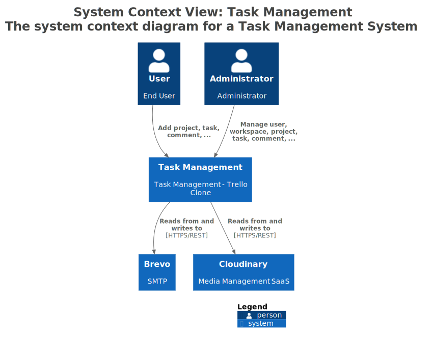
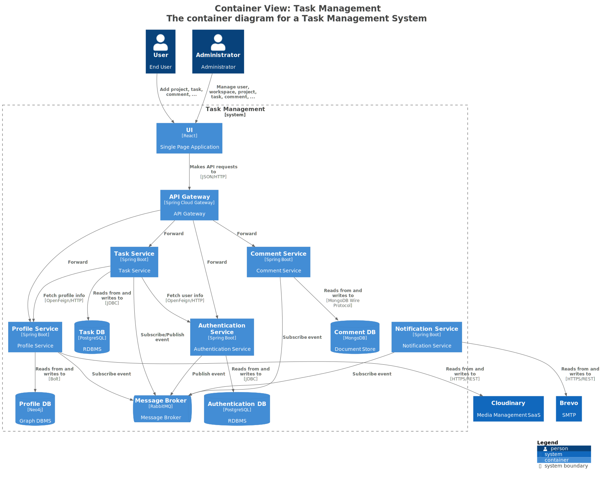
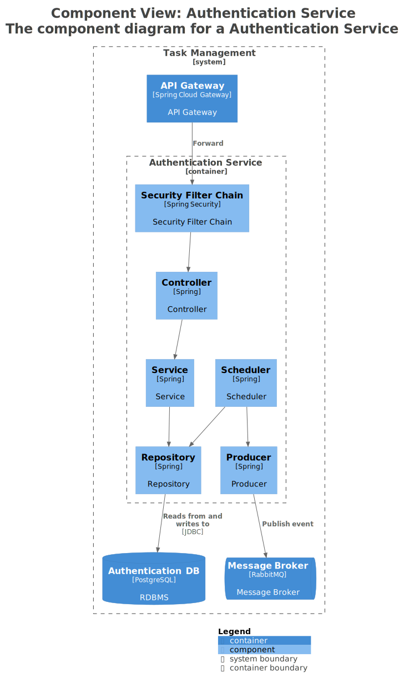
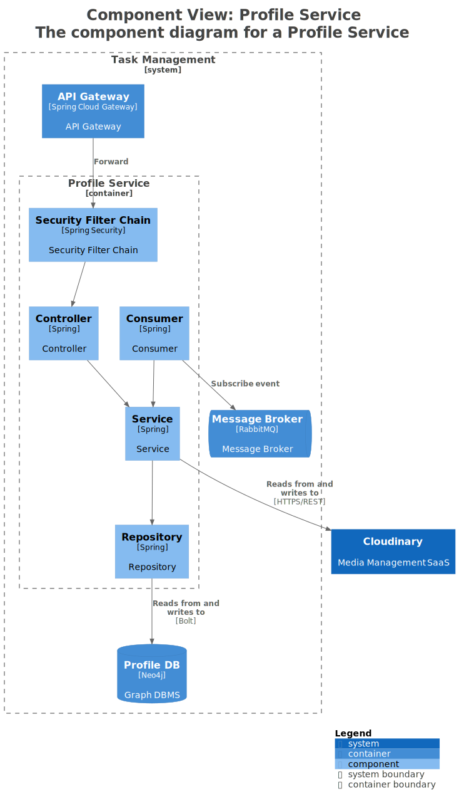
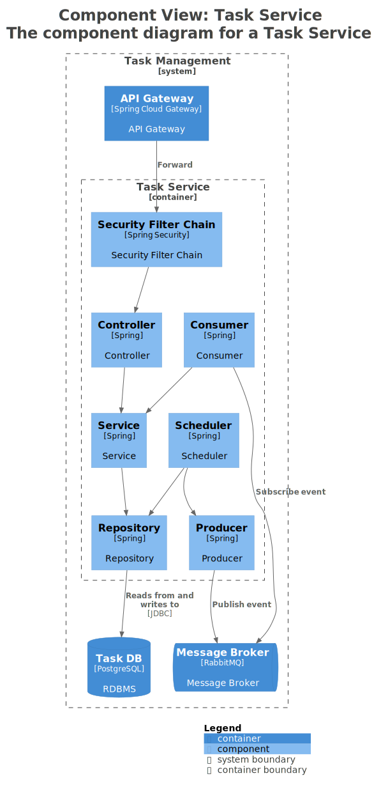
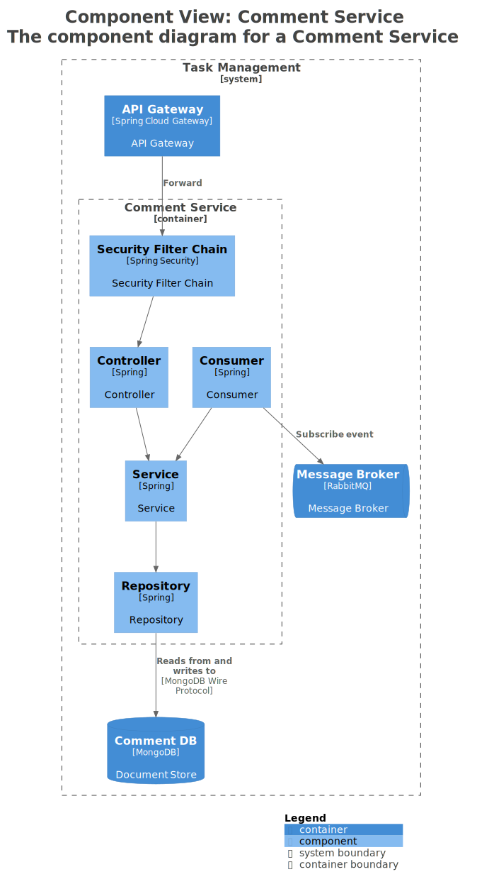
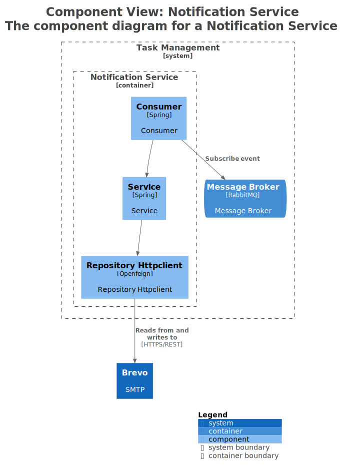

# C4 Model

Sơ đồ kiến trúc hệ thống **Task Management** theo [C4 Model](https://c4model.com), được sinh từ **Structurizr DSL** và
export ra nhiều định dạng.

## Cấu trúc

```
c4/
├── structurizr/    # Source DSL (workspace.dsl) — nguồn sự thật duy nhất
├── drawio/         # Manual Design (.drawio)
├── images/         # Export sang SVG
├── mermaid/        # Export sang Mermaid (.mmd)
└── plantuml/       # Export sang PlantUML (.puml)
```

> **Nguồn sự thật:** [`structurizr/workspace.dsl`](./structurizr/workspace.dsl) — mọi chỉnh sửa kiến trúc đều thực hiện
> ở đây, các định dạng khác được export ra từ file này.

## Các sơ đồ

### Context Diagram

Mô tả hệ thống Task Management trong môi trường tổng thể, bao gồm người dùng và các hệ thống bên ngoài.



### Container Diagram

Mô tả các service, database và cách chúng giao tiếp với nhau.



### Component Diagrams

Chi tiết bên trong từng service:

| Service                | Sơ đồ                                                                      |
|------------------------|----------------------------------------------------------------------------|
| Authentication Service |  |
| Profile Service        |                |
| Task Service           |                      |
| Comment Service        |                |
| Notification Service   |      |

## Công cụ

- [Structurizr Lite](https://structurizr.com/help/lite) — render và chỉnh sửa DSL
- [draw.io](https://app.diagrams.net) — mở file `.drawio`