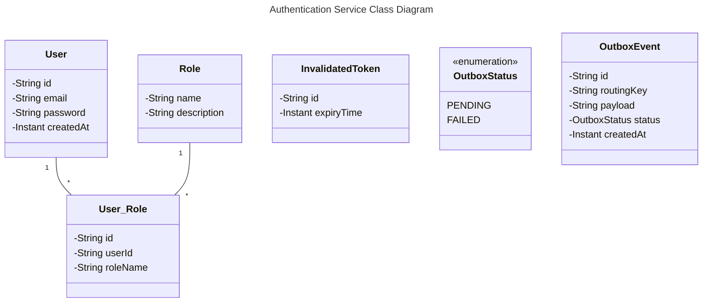
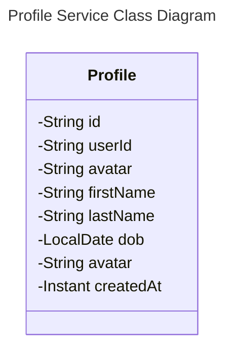
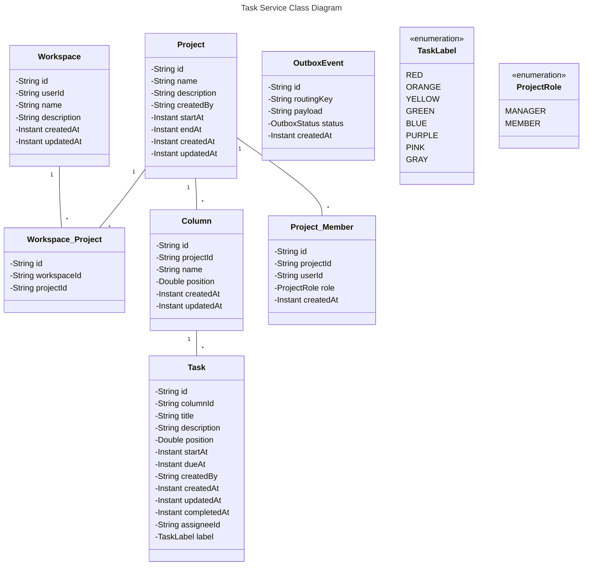
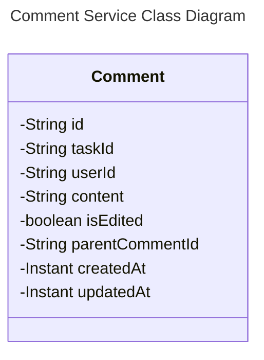

# Class diagrams

## Authentication service

```mermaid
---
title: Authentication Service Class Diagram
---
classDiagram
    class User {
        -String id
        -String email
        -String password
        -Instant createdAt
    }
    
    class Role {
        -String name
        -String description
    }
    
    class User_Role {
        -String id
        -String userId
        -String roleName
    }
    
    class InvalidatedToken {
        -String id
        -Instant expiryTime
    }

    class OutboxStatus{
        <<enumeration>>
        PENDING
        FAILED
    }
    
    class OutboxEvent {
        -String id
        -String routingKey
        -String payload
        -OutboxStatus status
        -Instant createdAt
    }

    User "1" -- "*" User_Role
    Role "1" -- "*" User_Role
```

## Profile service

```mermaid
---
title: Profile Service Class Diagram
---
classDiagram
    class Profile {
        -String id
        -String userId
        -String avatar
        -String firstName
        -String lastName
        -LocalDate dob
        -String avatar
        -Instant createdAt
    }
```

## Task service

```mermaid
---
title: Task Service Class Diagram
---
classDiagram
    class Workspace {
        -String id
        -String userId
        -String name
        -String description
        -Instant createdAt
        -Instant updatedAt
    }

    class Project {
        -String id
        -String name
        -String description
        -String createdBy
        -Instant startAt
        -Instant endAt
        -Instant createdAt
        -Instant updatedAt
    }

    class Column {
        -String id
        -String projectId
        -String name
        -Double position
        -Instant createdAt
        -Instant updatedAt
    }

    class Task {
        -String id
        -String columnId
        -String title
        -String description
        -Double position
        -Instant startAt
        -Instant dueAt
        -String createdBy
        -Instant createdAt
        -Instant updatedAt
        -Instant completedAt
        -String assigneeId
        -TaskLabel label
    }

    class OutboxEvent {
        -String id
        -String routingKey
        -String payload
        -OutboxStatus status
        -Instant createdAt
    }

    class TaskLabel {
        <<enumeration>>
        RED
        ORANGE
        YELLOW
        GREEN
        BLUE
        PURPLE
        PINK
        GRAY
    }

    class ProjectRole {
        <<enumeration>>
        MANAGER
        MEMBER
    }

    class Workspace_Project {
        -String id
        -String workspaceId
        -String projectId
    }

    class Project_Member {
        -String id
        -String projectId
        -String userId
        -ProjectRole role
        -Instant createdAt
    }

    Workspace "1" -- "*" Workspace_Project
    Project "1" -- "*" Workspace_Project
    Project "1" -- "*" Column
    Project "1" -- "*" Project_Member
    Column "1" -- "*" Task

```

## Comment service

```mermaid
---
title: Comment Service Class Diagram
---
classDiagram
    class Comment {
        -String id
        -String taskId
        -String userId
        -String content
        -boolean isEdited
        -String parentCommentId
        -Instant createdAt
        -Instant updatedAt
    }

```