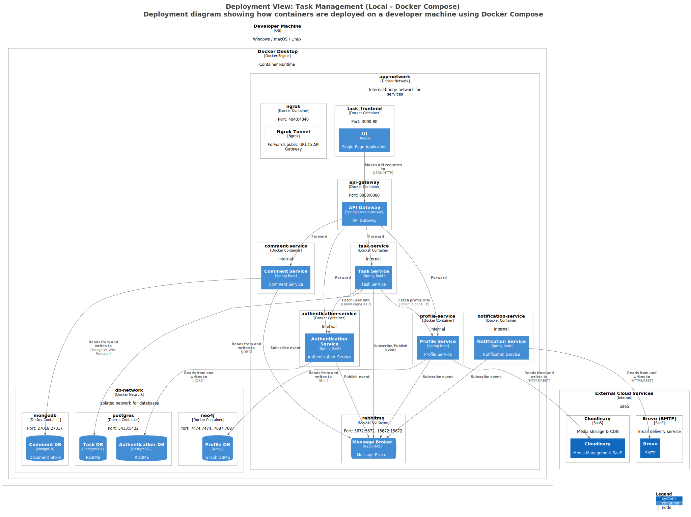

# Deployment Diagram

Sơ đồ triển khai mô tả kiến trúc hạ tầng của hệ thống **Task Management** khi chạy trên môi trường local bằng **Docker Compose**.

## Tổng quan

Toàn bộ hệ thống được container hóa và chạy trong Docker Desktop trên máy developer, với hai network nội bộ:

| Network        | Mục đích |
|----------------|----------|
| `app-network`  | Giao tiếp giữa các microservice và message broker |
| `db-network`   | Kết nối các service với database tương ứng |

## Thành phần triển khai

### Application Services (app-network)

| Container              | Image / Công nghệ      | Port (host:container) | Mô tả |
|------------------------|------------------------|-----------------------|-------|
| `task_frontend`        | React + Nginx          | `3000:80`             | Frontend SPA |
| `api-gateway`          | Spring Cloud Gateway   | `8888:8888`           | API Gateway — điểm vào duy nhất |
| `authentication-service` | Spring Boot          | *(internal)*          | Xác thực, cấp JWT |
| `profile-service`      | Spring Boot            | *(internal)*          | Hồ sơ người dùng, upload ảnh |
| `task-service`         | Spring Boot            | *(internal)*          | Workspace, Project, Column, Task |
| `comment-service`      | Spring Boot            | *(internal)*          | Bình luận trên Task |
| `notification-service` | Spring Boot            | *(internal)*          | Gửi email qua Brevo |
| `rabbitmq`             | RabbitMQ 3-management  | `5672:5672`, `15672:15672` | Message Broker |
| `ngrok`                | Ngrok                  | `4040:4040`           | Tunnel expose API Gateway |

### Databases (db-network)

| Container    | Image / Công nghệ   | Port (host:container) | Dùng bởi |
|--------------|---------------------|-----------------------|----------|
| `postgres`   | PostgreSQL 16       | `5433:5432`           | Authentication Service, Task Service |
| `neo4j`      | Neo4j Community     | `7474:7474`, `7687:7687` | Profile Service |
| `mongodb`    | MongoDB 7.0         | `27017:27017`         | Comment Service |

### External Cloud Services

| Dịch vụ       | Mục đích |
|---------------|----------|
| **Cloudinary**| Upload và lưu trữ avatar người dùng |
| **Brevo**     | Gửi email thông báo (SMTP) |

## Docker Compose Profiles

Hệ thống sử dụng Docker Compose **profiles** để cho phép khởi động từng phần:

| Profile         | Services được khởi động |
|-----------------|--------------------------|
| `auth`          | postgres, rabbitmq, authentication-service, api-gateway, autoheal |
| `profile`       | neo4j, rabbitmq, profile-service, api-gateway, autoheal |
| `task`          | postgres, rabbitmq, task-service, api-gateway, autoheal |
| `comment`       | mongodb, rabbitmq, comment-service, api-gateway, autoheal |
| `notification`  | rabbitmq, notification-service, api-gateway, autoheal |
| `frontend`      | frontend, ngrok |
| `full`          | Tất cả services |

**Ví dụ khởi động toàn bộ hệ thống:**
```bash
docker compose --profile full up -d
```

**Ví dụ khởi động riêng Authentication:**
```bash
docker compose --profile auth up -d
```

## Health Check & Auto-heal

Tất cả container đều được cấu hình với:
- **`healthcheck`** — Spring Boot Actuator (`/actuator/health`) hoặc lệnh kiểm tra native
- **`autoheal`** — container `willfarrell/autoheal` tự động restart container bị unhealthy

## Sơ đồ

### Hình ảnh (SVG)

Xem sơ đồ triển khai được render từ Structurizr:



### Source Files

| Định dạng  | File |
|------------|------|
| Mermaid    | [`mermaid/structurizr-DeploymentView.mmd`](./mermaid/structurizr-DeploymentView.mmd) |
| PlantUML   | [`plantuml/structurizr-DeploymentView.puml`](./plantuml/structurizr-DeploymentView.puml) |
| SVG Image  | [`images/structurizr-DeploymentView.svg`](./images/structurizr-DeploymentView.svg) |

## Luồng request điển hình

```
User (Browser)
    │
    ▼
[Ngrok Tunnel]  ──►  [API Gateway :8888]
                              │
              ┌───────────────┼───────────────────┐
              ▼               ▼                   ▼
  [Auth Service]    [Task Service]      [Profile Service]
        │                  │                    │
        ▼                  ▼                    ▼
  [PostgreSQL]       [PostgreSQL]            [Neo4j]
        │
        ▼
  [RabbitMQ]  ──►  [Profile Service]  ──►  [Neo4j]
              ──►  [Task Service]     ──►  [PostgreSQL]
              ──►  [Notification]    ──►  [Brevo SMTP]
```

## Tham khảo

- [docker-compose.yml](../../../../docker-compose.yml)
- [Deployment Mermaid](./mermaid/structurizr-DeploymentView.mmd)
- [Deployment PlantUML](./plantuml/structurizr-DeploymentView.puml)
