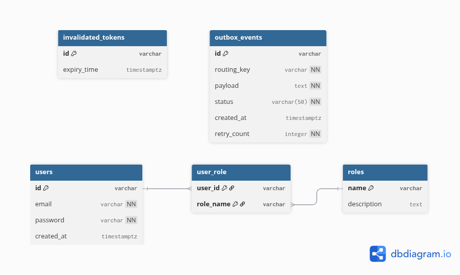
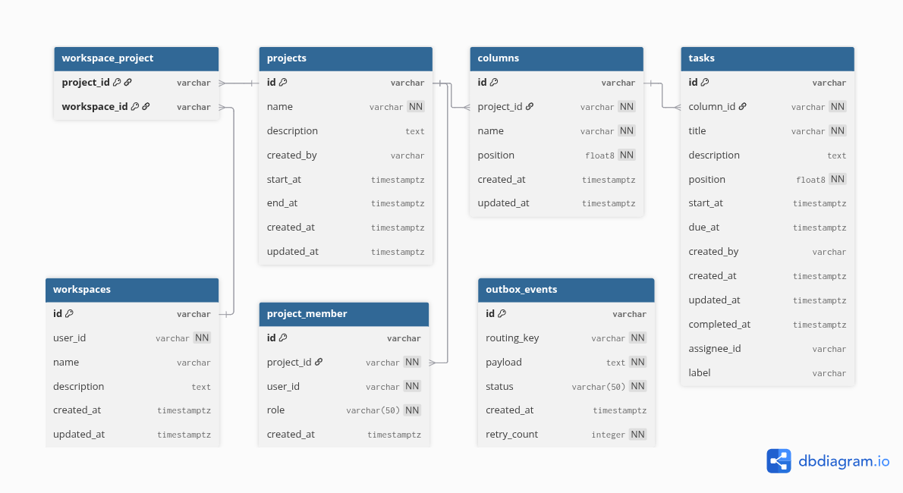
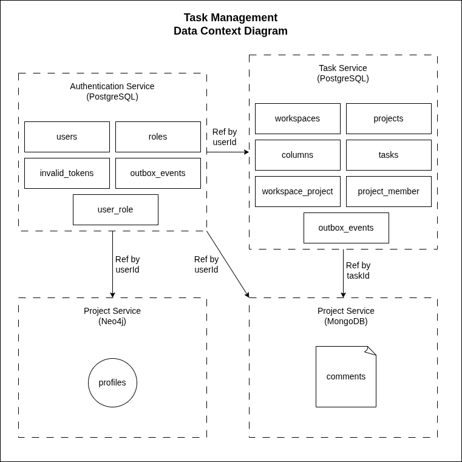

# Entity Relationship Diagrams (ERD)

Thư mục này chứa lược đồ thực thể - quan hệ (ERD) của từng database trong hệ thống **Task Management**.

Mỗi microservice sở hữu database riêng biệt, tuân thủ nguyên tắc **Database per Service** của kiến trúc microservices.

## Tổng quan Database

| Service                    | Database Engine | Schema / DB Name       | Ghi chú |
|----------------------------|-----------------|------------------------|---------|
| **Authentication Service** | PostgreSQL 16   | schema `auth`          | Bảng users, roles, JWT tokens |
| **Task Service**           | PostgreSQL 16   | schema `task`          | Workspace, Project, Column, Task |
| **Profile Service**        | Neo4j Community | graph database         | Node Profile, quan hệ follow/friend |
| **Comment Service**        | MongoDB 7.0     | collection `comments`  | Document-based comments |

> **Lưu ý:** Profile Service (Neo4j) và Comment Service (MongoDB) không có ERD dạng bảng truyền thống — xem phần class diagram tương ứng.

## ERD: Authentication Service

**Công cụ:** [dbdiagram.io](https://dbdiagram.io) — Source: [`dbdiagram/authentication-service.dbml`](./dbdiagram/authentication-service.dbml)

**Hình ảnh:**



### Bảng

| Bảng                | Mô tả |
|---------------------|-------|
| `users`             | Tài khoản người dùng (email, password hash) |
| `roles`             | Vai trò hệ thống (ADMIN, USER, ...) |
| `user_role`         | Bảng trung gian nhiều-nhiều giữa user và role |
| `invalidated_tokens`| JWT token bị vô hiệu hóa (logout / refresh) |
| `outbox_events`     | Transactional Outbox — đảm bảo publish event an toàn |

### Quan hệ

```
users (1) ──── (*) user_role (*) ──── (1) roles
```

- Một `user` có thể có nhiều `role` thông qua `user_role`
- Khi user bị xóa → `user_role` bị xóa theo (CASCADE)
- `outbox_events` được dùng để publish sự kiện `user.created` sang RabbitMQ bằng Outbox Pattern

---

## ERD: Task Service

**Công cụ:** [dbdiagram.io](https://dbdiagram.io) — Source: [`dbdiagram/task-service.dbml`](./dbdiagram/task-service.dbml)

**Hình ảnh:**



### Bảng

| Bảng               | Mô tả |
|--------------------|-------|
| `workspaces`       | Không gian làm việc của mỗi user |
| `projects`         | Dự án trong workspace |
| `workspace_project`| Bảng trung gian nhiều-nhiều giữa workspace và project |
| `project_member`   | Thành viên của project (role: MANAGER / MEMBER) |
| `columns`          | Cột kanban trong project |
| `tasks`            | Task trong cột (có hỗ trợ label, assignee, dueAt) |
| `outbox_events`    | Transactional Outbox — publish event `task.deleted`, ... |

### Quan hệ

```
workspaces (1) ──── (*) workspace_project (*) ──── (1) projects
projects (1) ──── (*) columns
projects (1) ──── (*) project_member
columns (1) ──── (*) tasks
```

- Xóa `project` → tất cả `column` và `task` bị xóa theo (CASCADE)
- Xóa `column` → tất cả `task` trong cột bị xóa theo (CASCADE)
- Xóa `project` → tất cả `project_member` bị xóa theo (CASCADE)

---

## ERD: Data Context Diagram

Sơ đồ tổng thể thể hiện mối quan hệ dữ liệu giữa các service:



---

## Source Files

| File | Mô tả |
|------|-------|
| [`dbdiagram/authentication-service.dbml`](./dbdiagram/authentication-service.dbml) | DBML schema của Authentication Service |
| [`dbdiagram/task-service.dbml`](./dbdiagram/task-service.dbml) | DBML schema của Task Service |
| [`images/authentication-service.png`](./images/authentication-service.png) | Ảnh ERD Authentication Service |
| [`images/task-service.png`](./images/task-service.png) | Ảnh ERD Task Service |
| [`images/data-context-diagram.png`](./images/data-context-diagram.png) | Sơ đồ data context toàn hệ thống |
| [`images/comment-service.png`](./images/comment-service.png) | Ảnh schema Comment Service |

## Nguyên tắc thiết kế

- **Database per Service**: Mỗi microservice có database độc lập, không dùng chung schema.
- **Outbox Pattern**: Authentication Service và Task Service dùng bảng `outbox_events` để đảm bảo tính nhất quán (at-least-once delivery) khi publish event lên RabbitMQ.
- **Đặt ID kiểu `varchar`**: Sử dụng UUID dạng chuỗi thay vì integer auto-increment để phù hợp môi trường phân tán.
- **Timestamp với timezone**: Tất cả timestamp dùng `timestamptz` để tránh lỗi múi giờ.

## Tham khảo

- [Class Diagrams](../class/class-diagram.md)
- [dbdiagram.io](https://dbdiagram.io)
- [Microservices Patterns — Database per Service](https://microservices.io/patterns/data/database-per-service.html)
- [Outbox Pattern](https://microservices.io/patterns/data/transactional-outbox.html)
